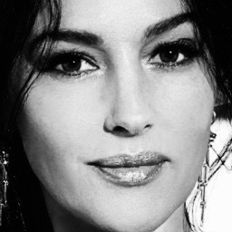
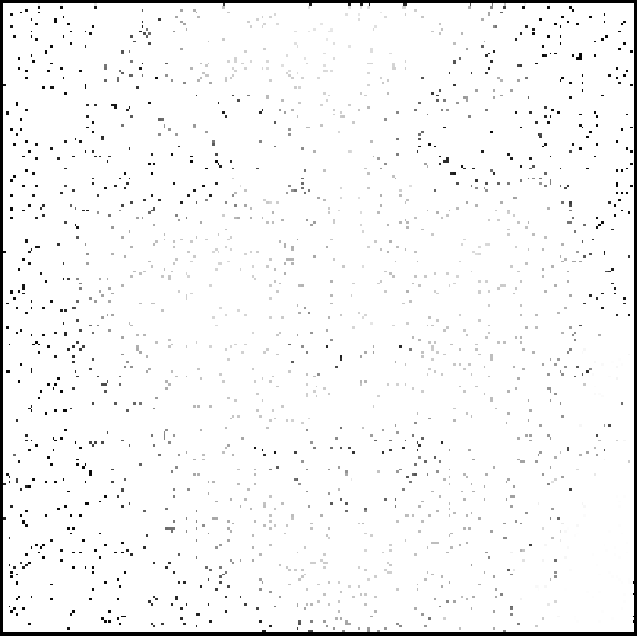
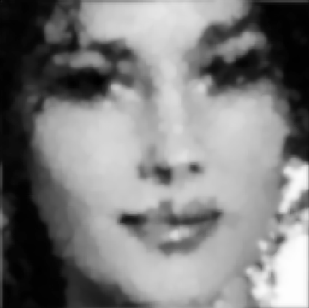
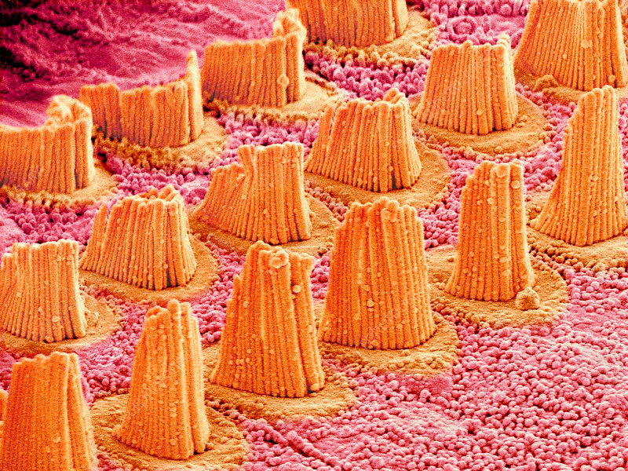

# Introduction

### Laboratory of Signals and Systems (L2S)

- Created in 1974
- Affiliations:
  - CNRS (Centre National de la Recherche Scientifique)
  - CentraleSupélec
  - University of Paris-Saclay
- Research fields:
  - Systems and control
  - Signal processing and statistics
  - Networks and telecommunication

### Supervision

- Dario Prandi
  - Affiliations: L2S, CNRS, CentraleSupélec, Université Paris-Saclay
  - Specialties:
    - Geometric control theory
    - Biomimetic image processing
    - Diffusions on singular manifolds
- Ugo Boscain
  - Affiliations: Laboratoire Jacques-Louis Lions, CNRS, Inria, Sorbonne Université
  - Specialties:
    - Sub-riemannian geometry
    - Control of quantum mechanical systems
    - (also) optimal control and switched systems

### Internship mission

Work on the proposed neuro-geometric sound reconstruction model.

Subtasks:

- Study the existing model
- Test on real speech signals
- Publish results
- Reimplement `WCA1.jl` package
- Rethink model & study litterature

# Image reconstruction model

## Neuro-geometric model of V1

### Basis of the V1 model - starting point

1. Hubel and Weisel (1959) [@hubel1959] observed that there are
   groups of neurons sensitive to positions and directions

\centering

{height=65%}

### Basis of the V1 model - 3D representation

2. Which inspired Hoffman (1989) [@hoffman1989] to model V1 as a contact space
   (a 3D manifold endowed with a smooth map)
3. The Citti-Petitot-Sarti (CPS) model (2006) [@petitot1999;@citti2006]
   extended the model to sub-Riemannian structures

The CPS model:

:::::::::::::: {.columns align=center totalwidth=100%}
::: {.column width="50%"}
- An image can be seen as a function $f:\R^2\rightarrow\R_+$ representing
  the grey level at given coordinates
- The primary visual cortex (V1) adds the non-directed angle $\theta\in P^1=\R/\pi\Z$
  of the tangent line to the curve.

  The visual cortex lifts a curve into $\R^2\times P^1$.
:::
::: {.column width="50%"}

:::
::::::::::::::

### Basis of the V1 model - image reconstruction

4. Ugo Boscain, Dario Prandi, Jean-Paul Gauthier, and their colleagues proposed (in 2017)
   [@boscain2017;@bertalmio2018] an image reconstruction model based on the CPS model.

If a curve is interrupted in an interval, then the visual cortex tries
to reconstruct it by taking the shortest curve in the lifted space.

{width=70%}

## Image reconstruction model

### Wilson-Cowan model [@wilson1972]

- The Wilson-Cowan (WC) model describes the evolution of neural activations
- WC describes the evolution of excitatory and inhibitory activity in
  a synaptically coupled neuronal network
- The interaction between the hypercolumns in V1 can be described through the WC equation [@bressloff2002]

Let $a(x,\theta,t)$ be the state of a population of neurons with coordinates $x\in\R^2$
and orientation $\theta\in P^1$ at time $t>0$, the WC integro-differential equation is given by [@bertalmio2018]

$$ \dtfrac a(x,\theta,t) = -\alpha a(x,\theta,t) + \nu
\int_{\R^2\times P^1} \omega(x,\theta\| x',\theta') \sigma(a(x',\theta',t)) \dx'\dtheta'
+ h(x,\theta,t) $$

### Reconstruction of a 97% corrupted image

:::::::::::::: {.columns align=center totalwidth=100%}
::: {.column width="30%"}
\centering

original
:::
::: {.column width="30%"}
\centering

corrupted
:::
::: {.column width="30%"}
\centering

reconstructed
:::
::::::::::::::

### Which begs the question

Can we apply these ideas to the problem of sound reconstruction?

# Sound reconstruction model

## From V1 to A1

### Motivation

A sound signal $s(t)$ can be seen as an image in the time-frequency domain $|S|(\tau,\w)$

\centering
\includegraphics[height=.7\textheight]{img/speech_spectrum.png}

### Taking into account:

1. In image reconstruction the whole image is evolved simultaneously.
   However, the sound image (spectrogram) does not reach the auditory
   cortex simultaneously but *sequentially*.
   Hence, the reconstruction can be performed only in a sliding window.
2. A rotated sound image corresponds to a completely different input sound,
   therefore the invariance by rototranslation is lost.

### Sound signal processing in the cochlea

:::::::::::::: {.columns align=center totalwidth=100%}
::: {.column width="70%"}
The primary auditory cortex (A1) receives the sensory input directly from the cochlea [@dallos1996],
which is a spiral-shaped fluid-filled cavity that composes the inner ear.

- The mechanical vibrations along the basilar membrane are transduced into electrical activity
  along a dense, topographically ordered, array of auditory-nerve fibers (hair cells)
  which convey these electrical potentials to the central auditory system.
- Since the inner hair cells are topographically ordered along the cochlea spiral,
  different regions of the cochlea are sensitive to frequencies as follows [@yang1992]:
  - Hair cells close to the base are more sensitive to low-frequency sounds
  - near the apex are more sensitive to high-frequency sounds
:::
::: {.column width="30%"}
\centering
{width=80%}

\par\vspace{1em}\par

:::
::::::::::::::

### Sound reconstruction pipeline

{width=100%}

## Time-Frequency representation

### Time representation & Frequency representation

:::::::::::::: {.columns align=center}
::: {.column width="60%"}
We consider a realizable sound signal $s\in L^2(\R)$

- **Frequency representation:**
  $$\hat s(\w) = \F\sset{s(t)}(\w) = \int_\R s(t) e^{-2\pi i\w t}\dt$$
- **Time representation:**
  $$s(t) = \F^{-1}\sset{\hat s(\w)}(t) = \int_\R \hat s(\w) e^{2\pi i\w t}\dw$$

Since $s=\F^{-1}\sset{\hat s}$, we can say about $s$ and $\hat s$ that they

- both contain the exact same information
- both represent the same object $s\in L^2(\R)$
- they simply show different features of $s$
:::
::: {.column width="40%"}
\centering

:::
::::::::::::::

A time-frequency representation would combine the features
of both $s$ and $\hat s$ into a single function.
Such representation provides an *instantaneous frequency spectrum*
of the signal at any given time [@grochenig2001].

### Short-Time Fourier Transform (STFT)

\begin{definition}[Short-Time Fourier Transform]
Let $s\in L^2(\R)$ be a time signal, let $\w\in L^2(\R)$ be a compactly supported window
centered around $0$.
The STFT of $s$ with respect to the window $w$ is defined as
$$S(\tau,\w) = \stft{s(t)}(\tau,\w) = \int_\R s(t)w(t-\tau)e^{-2\pi i\w t} \dt$$
\end{definition}

:::::::::::::: {.columns align=center}
::: {.column width="60%"}
The STFT is

- a very common time-frequency representation of a signal
- the Fourier transform of the $s(t)w(t-\tau)$,
  the signal taken over a sliding window along the time axis
- usually taken along a smooth window because a sharp cut-off introduces
  discontinuities and aliasing issues [@grochenig2001]
:::
::: {.column width="40%" align=center}

:::
:::::::::::::: 

### Time and frequency shifts operators

\begin{definition}[Time and frequency shifts operators]
Let $s\in L^2(\R)$ be a time signal, we define for all $\tau,\w\in\R$
\begin{itemize}
  \item \textbf{Time shift operator:}  $T_\tau s(t)=s(t-\tau)$
  \item \textbf{Phase shift operator:} $M_\w s(t)=e^{2\pi i \w t} s(t)$
\end{itemize}
We call $T_\tau$ and $M_\w$ unitary operators in $\U(L^2(\R))$
\end{definition}

The STFT can be formulated using these unitary operators
\begin{align*}
S(\tau,\w) &= \int_\R s(t)w(t-\tau)e^{-2\pi i\w t} \dt\\
    &= \int_\R s(t) \overline{M_\w T_\tau w(t)} \dt\\
    &= \dotp{s, M_\w T_\tau w}_{L^2(\R)}
\end{align*}

We can redefine the STFT as an operator $V_w$ on $s\in L^2(\R)$
defined in function of $T_\tau,M_\w\in\U(L^2(\R))$ [@grochenig2001;@boscain2021].
$$V_w s(\tau,\w) = \dotp{s, M_\w T_\tau w}_{L^2(\R)}$$

### Discrete STFT

Similarly to the continuous STFT, the discrete STFT is the
Discrete Fourier Transform (DFT) of the signal over a sliding window.
Nevertheless, the window cannot slide continuously along the time axis,
instead the signal is windowed at different frames with an overlap.
The window therefore hops along the time axis.

Discrete STFT parameters:

- Window size (DFT size): $N$
- Overlap size: $R$
- Hop size: $H=N-R$
- Overlap ratio: $r=R/N\in[0,1[$

\begin{definition}[Discrete Short-Time Fourier Transform]
The discrete STFT of a signal $s\in L^2([0,T])$ over a window $w$ is defined as
$$S[m,\w] = \sum_{t=0}^{T} s[t]w[t-mH]e^{-2\pi i\w t}$$
\end{definition}

### STFT windowing

The choice of the window affects the quality of the Fourier transform.

\begin{tabular}{ >{\centering\arraybackslash} m{3cm} >{\centering\arraybackslash} m{9cm} }

Window function & $\hspace{.7cm}s(t)w(t-t_0) \hspace{1.7cm} \F\sset{s(t)w(t-t_0)}(\w)$\\\hline
Rectangular     & \includegraphics[width=.6\textwidth]{img/w_rectangle.png}\\
Triangular      & \includegraphics[width=.6\textwidth]{img/w_triangle.png}\\
Hann            & \includegraphics[width=.6\textwidth]{img/w_hann.png}
\end{tabular}

### STFT windowing - invertibility constraints

:::::::::::::: {.columns align=center}
::: {.column width="60%"}
The STFT is invertible if its parameters satisfy the two following constraints [@muller2015;@griffin1983]:

- **Nonzero OverLap Add (NOLA):** $$\sum\limits_{m\in\Z} w^2[t-mH] \neq 0$$
- **Constant OverLap Add (COLA):** $$\sum\limits_{m\in\Z} w[t-mH] = 1$$

:::
::: {.column width="40%"}
\includegraphics[width=\textwidth]{img/woa_triangular_1_2.png}\par
Triangular window, overlap ratio $r=\frac{1}{2}$
\includegraphics[width=\textwidth]{img/woa_hann_1_2.png}\par
Hann window, overlap ratio $r=\frac{1}{2}$
\includegraphics[width=\textwidth]{img/woa_hann_3_8.png}\par
Hann window, overlap ratio $r=\frac{3}{8}$
:::
:::::::::::::: 

The NOLA condition is met for any window given an overlap ratio $r\in[0,1[$.
It is worth noting that this condition can be found without the square
depending on the inverse STFT algorithm.

The COLA constraint defines the partition of unity over the discrete time axis,
imposing a stronger condition.

### STFT windowing - Hann window

\begin{remark}
In typical applications, the window functions used are non-negative,
smooth, bell-shaped curves.
\end{remark}

In our model we use the Hann window, which satisfies the COLA condition
for any overlap ratio of $r=\frac{n}{n+1},n\in\N^*$.

The Hann window of length $L$ is defined as
$$w(x)=\begin{cases}
\frac{1+\cos\pp{\frac{2\pi x}{L}}}{2} & \text{if}~\abs{x}\leq\frac{L}{2}\\
0 & \text{if}~\abs{x}>\frac{L}{2}
\end{cases}$$

### Uncertainty principles

In mathematics, uncertainty principles are

- limits to the accuracy with which the values for certain physical pairs can be obeserved
- inequilities that involve pairs of complementary/disjoint variables

Common examples are

- **Heisenberg's Uncertainty Principle:** a particle's momentum and its position
- **The Heisenberg-Gabor limit:** a signal's time and frequency

\begin{theorem}[Heisenberg-Pauli-Weyl inequality]
Let $f\in L^2(\R)$, then $\forall a,b\in\R$
$$ \pp{\int_\R (t-a)^2\abs{f(t)}^2\dt}^{1/2}
   \pp{\int_\R (\w-b)^2\abs{\hat f(\w)}^2\dw}^{1/2}
   \geq \frac{\norm{f}_2^2}{4\pi}$$
\end{theorem}

### Uncertainty principle - the Heisenberg-Gabor limit

From the Heisenberg-Pauli-Weyl Inequality, we obtain the following theorem
\begin{theorem}[Heisenberg-Gabor limit]
Let $f\in L^2(\R)$, if $\norm{f}_2 = 1$ then
$$\sigma_t\cdot\sigma_\w \geq \frac{1}{4\pi}$$
where $\sigma_t$ and $\sigma_\w$ are the standard deviations of the time and frequency respectively.
\end{theorem}
Interpretation of the standard deviations:

- $\sigma_t$ is the size of the *essential support* of $f$
- $\sigma_\w$ is the size of the *essential bandwidth* of the signal
  centered around the average frequency $\bar\w$

The Gabor limit means that

- "a realizable signal occupies a region of area at least one in the time-frequency plane."
- we cannot sharply localize a signal in both the time domain and frequency domain
- the concept of an instantaneous frequency is impossible [@grochenig2001]

### Uncertainty principle - resolution issues

STFT resolution with respect to different window sizes $\Delta T$ and overlap ratios $r$

:::::::::::::: {.columns align=center}
::: {.column width="60%"}
{height=80%}
:::
::: {.column width="40%"}
Influence of the window size and the overlap ratio:

- **Window size:**
  - Larger windows $\implies$ higher frequency resolution & lower time resolution
  - Smaller windows $\implies$ lower frequency resolution & higher time resolution
- **Overlap:**
  - Small overlaps $\implies$ time discontinuities & computationally cheaper
  - Big overlaps $\implies$ more time precision & computationally costly
:::
:::::::::::::: 

### Inverse STFT

\begin{theorem}[Parseval's Formula for the STFT]
Consider two signals $s_1,s_2\in L^2(\R)$, and two windows $w_1,w_2\in L^2(\R)$, then
$$ \dotp{V_{w_1}s_1,V_{w_2}s_2}_{L^2(\R^2)} =
   \dotp{s_1,s_2}_{L^2(\R)} \bbar{\dotp{w_1,w_2}}_{L^2(\R)} $$
\end{theorem}

\begin{prop}
If $\norm{w}_2=1$ then the STFT operator $W_w$ is an isometry from $L^2(\R)$ to $L^2(\R^2)$.\par
This can be easily shown from Parseval's Formula
$$ \forall s,w\in L^2(\R), \norm{V_w s}_2=\norm{s}_2 \norm{w}_2\implies 
  \norm{V_w s}_2=\norm{s}_2,\forall s\in L^2(\R)~\text{if}~\norm{w}_2=1$$
\end{prop}

\begin{theorem}[Inverse Short-Time Fourier Transform]
Let $w,h\in L^2(\R)$ with $\dotp{w,h}\neq0$. Then for all $s\in L^2(\R)$
$$s(t) = \frac{1}{\dotp{w,h}} \iint_{\R^2}V_w s(\tau,\w)M_\w T_\tau h(t) \dw\dtau
       = \frac{1}{\dotp{w,h}} \iint_{\R^2} S(\tau,\w) h(t-\tau) e^{2\pi i\w t} \dw\dtau $$
\end{theorem}

### Inverse STFT - Griffin-Lim Algorithm [@griffin1983]

:::::::::::::: {.columns align=center}
::: {.column width="50%"}
Advantages:

- efficient and easy to implement
- works on modified STFT

General idea:

- Let $Y\in L^2(\R^2)$ be a modified STFT
- There might not be $y\in L^2(\R)$ such that $Y=V_w y$
- The GLA finds a signal $x\in L^2(\R)$ with $X=V_w x$
  that minimizes $d(X,Y)=\norm{X-Y}_2^2$
- We consider $x$ the inverse STFT of the modified STFT $Y$.
:::
::: {.column width="50%"}
Algorithm:

- Calculate $y_\tau \in L^2(R^2)$ the inverse Fourier transform
  of $Y$ with respect to the frequency $\w$ at a fixed time $\tau$.
  $$y_\tau(t) = \int_{\R} Y(\tau,\w) e^{2\pi i\w t} \dw$$
- Find iteratively the signal $x$ that minimizes $d(X,Y)$
  $$x[t] = \frac{\sum\limits_\tau y_\tau[t]w[t-\tau]}{\sum\limits_\tau w^2[t-\tau]}$$
:::
:::::::::::::: 

## The lift to the augmented space

### The sound chirpiness

3D representation in our models

- **V1 model:** sensitivity to directions $$\theta\in P^1=\R/\pi\Z$$
- **A1 model:** sensitivity to sound chirpiness $$\nu=\frac{\dw}{\dtau}\in\R$$

Interpretation of the *instantaneous chirpiness*:

- the time derivative of the frequency
- the slope of the frequency $w(t)$
- the tangent of the sound image directions $\tan\theta$

### The sound chirpiness - single frequency spectrum

\centering
\begin{tabular}{ >{\centering\arraybackslash} m{6cm}|>{\centering\arraybackslash} m{6cm} }
\textbf{Single constant frequency} & \textbf{Single time-varying frequency}\\\hline &\\
$s(t)=A\cdot sin(\w_0 t)$          & $s(t)=A\cdot sin(\w(t) t)$ \\[0.6em]
$\hat s(\w) = \frac{A}{2i} (\delta_0(\w-\w_0) - \delta_0(\w+\w_0))$ &
$S(\tau,\w) = \frac{A}{2i} (\delta_0(\w-\w(\tau)) - \delta_0(\w+\w(\tau)))$\\[0.6em]
\includegraphics[width=.30\textwidth]{img/sine_spectrum.png} &
\includegraphics[width=.25\textwidth]{img/single_freq.png}\\[0.4em]
\end{tabular}

### The sound chirpiness - single time-varying frequency

:::::::::::::: {.columns align=center}
::: {.column width="70%"}
Parametric representation of the sound $$s(t)=A\cdot sin(\w(t) t)$$

- In the time-frequency domain: $t\mapsto(t,\w(t))$
- In the *augmented space*: $t\mapsto(t,\w(t),\nu(t))$

with $$\nu(t)=\frac{\dw}{\dt}(t)$$
:::
::: {.column width="30%"}
{width=100%}
:::
::::::::::::::

### Representation in contact space - control system

What's the nature of the curve $t\mapsto(t,\w(t),\nu(t))$?

Let's define $u(t)=\dnu/\dt$, the curve in the contact space $t\mapsto(t,\w(t),\nu(t))$
is *a lift of a planar curve if there exists a function* $u(t)$ such that

$$\ddt\pmat{\tau\\\w\\\nu} = \pmat{1\\\nu\\0} + u(t)\pmat{0\\0\\1}$$

Let $q=(\tau,\w,\nu)$, the previous equations is the state equation
of a control system written as
$$\ddt q(t) = X_0(q(t)) + u(t) X_1(q(t))$$

where $X_0(q(t))$ and $X_1(q(t))$ are two vector fields in $\R^3$
$$X_0\pmat{\tau\\\w\\\nu} = \pmat{1\\\nu\\0},\quad 
X_1\pmat{\tau\\\w\\\nu} = \pmat{0\\0\\1}$$

### Representation in contact space - Heisenberg group

The two vector fields in $\R^3$
$$X_0\pmat{\tau\\\w\\\nu} = \pmat{1\\\nu\\0},\quad 
X_1\pmat{\tau\\\w\\\nu} = \pmat{0\\0\\1}$$

Generate the **Heisenberg group** because [@boscain2021;@grochenig2001]

- $Z=[X_0,X_1]\neq 0$
- $[Z,X_0]=[Z,X_1]=0$

### Lift to the contact space

We lift the each level line of the spectrum $\abs{S}(\tau,\w)$ to the contact space.
Yeilding the following subset of the contact space, which is a well-defined surface
if $\abs{S}\in\Cl^2$ and $\mathrm{Hess}\abs{S}$ is non-degenerate [@boscain2021].

$$\Sigma = \sset{(\tau,\w,\nu)\in\R^3 \vert\nu\partial_\w\abs{S}(\tau,\w) + \partial_\tau\abs{S}(\tau,\w) = 0}$$

Which allows to finally define the sound lift in the contact space as

$$L(\tau,\w,\nu) = S(\tau,\w)\cdot\delta_\Sigma (\tau,\w,\nu) =
\begin{cases}
S(\tau,\w) & \text{if}~(\tau,\w,\nu)\in\Sigma\\
0          & \text{otherwise}
\end{cases}$$

The time-frequency representation is obtained from the lifted sound
by applying the projection operator defined as

$$\Proj\sset{L(\tau,\w,\nu)}(\tau,\w) = \int_\R L(\tau,\w,\nu)\dnu$$

## Cortical activations in A1

### Cortical activations in A1 - Wilson-Cowan model

We model the cortical activations in A1 as follows

- The primary aidtory cortex (A1) is a space of $(\w,\nu)\in\R^2$.
- A1 receives the sound lift to the contact space $L(t,\w,\nu)$ at every instant $t$.
- The *neuron* receives an external charge $S(t,\w)$ if $(t,\w,\nu)\in\Sigma$
  and no charge otherwise.

We need to model these neural activations $\rightsquigarrow$ Wilson-Cowan model

- Successfully applied to describe neural activations in V1 and A1
  [@ermentrout1979;@bressloff2002a;@loebel2007;@rankin2015;@zulfiqar2019;@boscain2017;@bertalmio2018]
- Flexible model, applies independently to the underlying geometric structure
- Geometric structure is encoded in the kernel of the integral term
- Implementation of delay terms

### Wilson-Cowan equation

$$\dtfrac a(t,\w,\nu) = -\alpha a(t,\w,\nu) + \beta L(t,\w,\nu)
+ \gamma\int_{\R^2} k_\delta(\w,\nu\Vert\w',\nu') \sigma(a(t-\delta,\w',\nu')) \dw'\dnu'$$

where

- $\alpha,\beta,\gamma>0$ are (tuning) parameters
- $\sigma:\C\rightarrow\C$ is a non-linear sigmoid
  - $\sigma(\rho e^{i\theta})=\tilde\sigma(\rho)e^{i\theta}$
  - $\tilde\sigma(x)=\min\sset{\max\sset{0,\kappa x}, 1},\forall x\in\R$ given a fixed $\kappa>0$
- $k_\delta(\w,\nu\Vert\w',\nu')$ is a weight modeling the interaction
  between $(\w,\nu)$ and $(\w',\nu')$ after a delay $\delta>0$ via the kernel of the transport-diffusion
  operator associated to the contact structure of A1

### Wilson-Cowan equation with no delay

When $\gamma=0$, the WC equation becomes a standard low-pass filter
$$\partial_t a(t,\w,\nu)=-\alpha a(t,\w,\nu) + L(t,\w,\nu)$$

whose solution is simply
$$a(t,\w,\nu) = \int_0^t e^{-\alpha(s-t)}L(t,\w,\nu)\ds$$

Here, $\w$ and $\nu$ are parameters $\rightsquigarrow$ there is no interaction between regions
sensitive to different $\w$ and $\nu$.

### Wilson-Cowan equation with delayed interaction

$$\dtfrac a(t,\w,\nu) = -\alpha a(t,\w,\nu) + \beta L(t,\w,\nu)
+ \gamma\int_{\R^2} k_\delta(\w,\nu\Vert\w',\nu') \sigma(a(t-\delta,\w',\nu')) \dw'\dnu'$$

With $\gamma\neq0$, a non-linear term is added on top of the low-pass filter:

- The added term describes the diffusion of the activation in side A1
- The added term encodes the inhibitory and excitatory interconnections between neurons
- The sigmoid is a non-linear function that saturates the signal $a$

# Implementation

## The `WCA1.jl` package

### The Julia language

The Julia language is

- New
  - First appeared in 2012
  - Version 1.0 was released in 2018
- Fast: comparable to Fortran and C
- Easy to use: similar to Python, Matlab, and R
- General-purpose
- Great for scientific computing

Julia community is small: in 2021 Stack Overflow Developer Survey [@so_survey2021]
"Which language developers wanted to work in over the next year?"

- Julia: 1.29%
- Python: 48.24%
- Matlab: 4.66%

Result: less stable scientific libraries in Julia than other languages

### The `WCA1.jl` package

- Original code: [`https://github.com/dprn/WCA1`](https://github.com/dprn/WCA1)
- Forked repository: [`https://github.com/rand-asswad/WCA1`](https://github.com/rand-asswad/WCA1)

Issues with original code:

- Unstable $\rightsquigarrow$ failed to run on speech signals
- Far from optimal $\rightsquigarrow$ took long time to run on speech signals
- Low readability
- Non-conforming to Julia's code norms and performance recommendations

### The STFT module

**Issue:** no implementation of the inverse STFT in Julia's standard libraries
([`FFTW.jl`](https://juliapackages.com/p/fftw) and[`DSP.jl`](https://juliapackages.com/p/dsp)).

**Solution:** implemented the Griffin-Lim algorithm [@griffin1983] from scratch

### The Lift module - calculating chirpiness values

The sound chirpiness is defined as
$$\nu\partial_\omega\abs{S}(\tau,\omega) + \partial_\tau\abs{S}(\tau,\omega)=0$$

We compute the chirpiness with respect to each time-frequency pair
by calculating the gradient of the spectrum $\nabla\abs{S}$.

$$\nu(\tau,\w) =
\begin{cases}
-\frac{\partial_\tau\abs{S}(\tau,\w)}{\partial_\w\abs{S}(\tau,\w)} & \text{if}~\abs{\partial_\w\abs{S}(\tau,\w)}>\epsilon\\
0 & \text{otherwise}
\end{cases}$$

where $\epsilon$ is a small threshold.

### The Lift module - chirpiness sampling issue

**Issue:** the chipriness values $\nu$ are unbounded since
$$\nu\partial_\omega\abs{S}(\tau,\omega) + \partial_\tau\abs{S}(\tau,\omega)=0$$

and there exists points $(\tau_0,\w_0)$ such that
$\partial_\omega\abs{S}(\tau_0,\omega_0)=0$

therefore chirpiness values stretch over the entire real line (coverge to $\pm\infty$)

**Original solution:** manually restrict chirpiness values to $\nu\in[\numin,\numax]$
for synthetic signals (the limits are determined after visualizing the histogram
of the chirpiness values).

**Needed solution:** a reliable method to automatically determine the interval $[\numin,\numax]$
without losing (a lot of) values.

### The Lift module - chirpiness values distribution

We noticed that the chirpiness values of speech signals follow a Cauchy distribution [@asswad2021]

:::::::::::::: {.columns align=center}
::: {.column width="60%"}
Let $X$ be a random variable following $\Cd(x_0, \gamma)$

- **Location parameter $x_0$:** location of the peak
- **Scale parameter $\gamma$:** half the interquartile range

Probability density function (PDF):
$$f_X(x)=\frac{1}{\pi\gamma\pp{1+\pp{\frac{x-x_0}{\gamma}}^2}}$$

Cumulative distribution function (CDF):
$$F_X(x)=\frac{1}{\pi} \arctan\pp{\frac{x-x_0}{\gamma}} + \frac{1}{2}$$
:::
::: {.column width="40%"}

:::
:::::::::::::: 

### The Lift module - chirpiness values distribution

:::::::::::::: {.columns align=center}
::: {.column width="50%"}
Estimating Cauchy parameters $\Cd(x_0, \gamma)$:

- $x_0$: the chirpiness samples median
- $\gamma$: half the interquartile range (difference between
  the 75^th^ and the 25^th^ percentile)

Assumption:
$$\nu\sim\Cd\pp{\med(\nu),\frac{Q(75\%)-Q(25\%)}{2}}$$

Stastical tests on a library of real speech signals **rejected**
the assumption.

Nevertheless, the fit is quite good according to the Kolomogorov-Smirnov statistic
$$D_n=\sup_x\abs{F_n(x)-F_X(x)}$$

where $F_n$ is the empirical distribution function
:::
::: {.column width="50%"}

\begin{center}\centering
\includegraphics[width=0.3\textwidth]{img/cauchy_pt_estimate_iqr_2.png}
\includegraphics[width=0.3\textwidth]{img/cauchy_values_percentage_iqr_2.png}
\end{center}

Box plots for estimated Cauchy distributions of speech signals chirpiness values

- *left:* Kolmogorov-Smirnov statistic values.
- *right:* percentage of values falling in $I_{0.95}$
:::
:::::::::::::: 

### The Lift module - chirpiness sampling

1. Calculate chirpiness values for each $(\tau,\w)$
2. Compute values to Cauchy distribution to find confidence interval $I_p=[\numin,\numax]$
3. Discretize chirpiness values $\nu\in I_p$ as follows

Let $(\nu_n)_{1\leq n\leq N}$ such that $\numin=\nu_1<\cdots<\nu_N=\numax$.

Each value $\nu$ is rounded to the nearest $\nu_n$.

$$n(\nu) = \round{\frac{\nu - \numin}{\numax - \numin}(N-1) + 1},\quad\forall\nu\in I_p$$

where $\round{\cdot}:\R\rightarrow\Z$ is the rounding function to the nearest integer.

### The Lift module - chirpiness sampling optimization

The function $n(\nu)$ can be optimized by rewriting it as an affine function

$$n(\nu) = \round{\frac{\nu - \numin}{\numax - \numin}(N-1) + 1}
  = \round{\underbrace{\pp{\frac{N-1}{\numax - \numin}}}_a \cdot\nu
    + \underbrace{\pp{1 - \frac{(N-1)\numin}{\numax - \numin}}}_b}
  = \round{a\cdot\nu + b}$$

This reduces the number of arithmetic operations inside the loop in $O(n)$ complexity.

### The Lift module - chirpiness sampling benchmark

Using Julia's standard benchmark tools, we ran a benchmark on the speech library samples
with different chirpiness implementations.

:::::::::::::: {.columns align=center}
::: {.column width="60%"}
{width=100%}

The benchmarked median time for each method ploted against the speech samples
:::
::: {.column width="40%"}
{width=80%}

Box plots of the benchmarked time for each method on the samples from the speech library
:::
:::::::::::::: 

## Published results

### Denoising experiment [@asswad2021]

We apply a gaussian random noise $g_\eps\sim\Nd(0,\eps)$ to a an input sound $s$, we process the noisy sound input through the algorithm pipeline

- **Input:** $s_\eps = s + g_\eps$
- **Output:** $\tilde s_\eps=\STFT^{-1}\circ\Proj\circ\mathrm{WC}\circ\mathrm{Lift}\circ\STFT(s_\eps)$

:::::::::::::: {.columns align=center}
::: {.column width="50%"}
{width=90%}
:::
::: {.column width="50%"}
{width=90%}
:::
:::::::::::::: 

Distance of noisy sound to original one before (blue) and after (red) the processing, plotted against the standard deviation of the noise $\eps$ (where $\norm{s}=\norm{s}_1/\dim(s)$)

# Conclusion

## Reviewing the model

### Model analysis

The sound reconstruction model:

- improves noisy speech signals
- is mathematically stable
- has great potential

Conclusion:

- the model should be improved and adapted to more corrupted sounds
- the model deserves to be the basis of a PhD project

We will see the paths we explored to improve the model

### Model analysis - Lift drawbacks

:::::::::::::: {.columns align=center}
::: {.column width="50%"}
- The lifted representation $L(\tau,\w,\nu)=S(\tau,\w)\delta_\sigma(\tau,\w,\nu)$
  depends on the phase of $S(\tau,\w)\in\C$.
  This is unrealistic, since the cochlea only transmits the spectrogram
  $\abs{S(\tau,\w)}$ because A1 is insensitive to phase.
- At a fixed time $t>0$, the resulting representation $L(t,\w,\nu)$ is a distribution,
  concentrated on a one dimensional curve in the frequency-chirpiness space
  which is also unrealistic.
- The current procedure to obtain $L(\tau,\w,\nu)$ requires to first compute $S(\tau,\w)$
  and then to "lift" it.
  We would like to obtain $L$ directly from the original signal $s$.
:::
::: {.column width="50%"}
To improve the model, it is crucial to devise a novel lift procedure allowing to bypass these problems.

{width=100%}

Alternative sound reconstruction pipeline
:::
:::::::::::::: 

### Model analysis - Wavelet Transform

By reading state-of-the-art literature on the neurophysiology of the inner ear,
we realized that a Wavelet transform represents the signal processing
in the cochlea than the STFT transform [@yang1992;@reimann2011].

\begin{definition}[Wavelet Transform]
The Wavelet Transform (WT) of a realizable signal $s\in L^2(\R)$ along
a wavelet $\psi\in L^2(\R)$ is defined by
$$W_\psi s(a,t) = \frac{1}{\sqrt{a}} \int_\R s(\tau) \overline{\psi\pp{\frac{\tau-t}{a}}} \dtau$$
where $a$ is the dilation variable.
\end{definition}

### Model analysis - Wavelet Transform

**Advantage:** time resolution increases for higher frequencies in the WT.

**Disadvantage:** the dilation variable $a$ implicitly represents the frequency $\w$.

- Obtaining the sound chirpiness $\nu$ is not straightforward as in the case of the STFT
- We haven't been able to define an appropriate lift from the WT

### Model analysis - the lift operator

We defined the STFT as operator on $L^2(\R)$ in function of the unitary shift operators

$$V_w s(\tau,\w) = \dotp{s, M_\w T_\tau w}_{L^2(\R)}$$

We would like to have

$$L_\gamma s(\tau,\w,\nu) = \dotp{s,C_\nu M_\w T_\tau \gamma}_{L^2(\R)}$$

where $C_\nu\in\U(L^2(\R))$

Such operator would be

- Mathematically stable and elegant
- Computationally cheap

## Acquired knowledge

### Acquired knowledge

- Fundamental mathematics
  - Geometry
  - Group representations
  - Operator algebra
  - Time-Frequency analysis
- Applied mathematics & programming
  - Signal processing & DSP
  - Julia language
  - Neural activations models 
- The neuro-physiology of the inner ear
- Research experience
  - Studying state-of-the-art litterature
  - Co-writing a conference paper
  - Attending the GSI 2021 conference

## Future project

### My future project

After my internship, I have decided to pursue

- a Master's degree in fundamental mathematics
  at Université de Lorraine, focusing on PDEs and Control Theory
- a PhD thesis in the domains of PDEs and Control Theory
- a career in academic research

---

\centering

\huge Thank you for your attention!

## References

### References {.allowframebreaks}